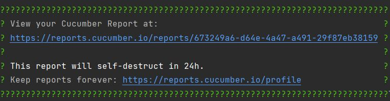
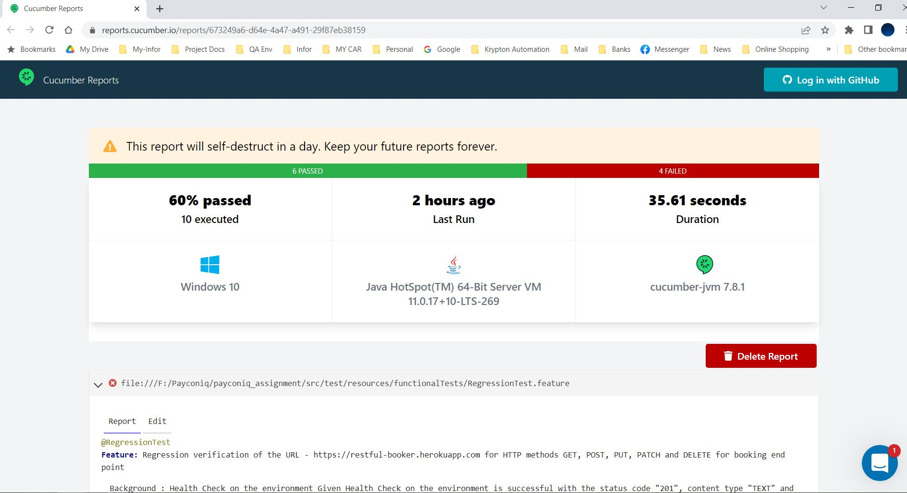

# API Assignment

>This is an API automation test project written as an assignment for an interview process.
Testing requirements are to validate the given end points in the below API Documentation against the mentioned HTTP methods.

**API Documentation** :

http://restful-booker.herokuapp.com/apidoc/index.html#api-Booking-GetBookings

## Tools and Technologies
* Java 11
* REST Assured 
* Cucumber 
* JUnit
* Maven

## Required software & Installation guide

* Java JDK 11 installed and in your classpath
* Maven installed and in your classpath

## How to execute the tests in command line

- Clone the project
- Open the cmd and change directory(cd) to the cloned project folder
- Execute command to run all API Test: `mvn test`
- Execute command to run Smoke Tests: `mvn test -D"cucumber.filter.tags=@SmokeTest"`
- Execute command to run Regression Tests: `mvn test -D"cucumber.filter.tags=@RegressionTest"`

## Test Report

* Results link will be generated and  displayed in the execution terminal

  

* To view the detailed results click on the generated link

  
